# 🚨 Awesome Computer-Aided Dispatch (CAD) Software & Platforms Ecosystem 🚑

<div align="center">
  
</div>

<br/>

<div align="center">
  <a href="https://github.com/ishandutta2007/Awesome-Awesome-Awesome"></a><a href="https://discord.gg/jc4xtF58Ve"></a>
  <a href="https://github.com/ishandutta2007/Awesome-Computer-Aided-Dispatch/stargazers"></a>
  <a href="https://github.com/ishandutta2007/Awesome-Computer-Aided-Dispatch/network/members"></a>
  <a href="https://github.com/ishandutta2007/Awesome-Computer-Aided-Dispatch/blob/main/LICENSE"></a>
  <a href="https://github.com/ishandutta2007"></a>
</div>

<br/>

> **A curated, comprehensive list of Computer-Aided Dispatch (CAD) platforms, Next-Gen 911 (NG911) call-handling software, Automatic Vehicle Location (AVL) tools, emergency medical/fire/police response systems, and self-hosted open-source dispatch repositories.** 📡

---

## 📑 Table of Contents
- [🌐 Market Overview & Sector Structure](#-market-overview--sector-structure)
- [🏢 SaaS & Commercial Enterprise CAD Platforms](#-saas--commercial-enterprise-cad-platforms)
- [💻 Open-Source & Self-Hosted CAD Repositories](#-open-source--self-hosted-cad-repositories)
- [🛠️ Key Features & Architecture Capabilities](#-key-features--architecture-capabilities)
- [🤝 How to Contribute](#-how-to-contribute)
- [💖 Support & Community](#-support--community)
- [📈 Star History](#-star-history)
- [⚠️ Disclaimer](#%EF%B8%8F-disclaimer)

---

## 🌐 Market Overview & Sector Structure

The global **Computer-Aided Dispatch (CAD) software market** is estimated at **~$2.85 Billion USD** and is projected to reach **~$4.60 Billion USD by 2030** (growing at a CAGR of ~7.8%). 

The market is **moderately concentrated** at the enterprise level, dominated by legacy public safety giants (*Motorola Solutions, Hexagon AB, Tyler Technologies, CentralSquare*), while remaining **fragmented** across next-generation cloud-native platforms (*Mark43, RapidDeploy, Carbyne*) and specialized niche/volunteer dispatch software.

---

## 🏢 SaaS & Commercial Enterprise CAD Platforms

The table below lists top commercial SaaS and enterprise CAD platforms for 911 Public Safety Answering Points (PSAPs), law enforcement, fire departments, and EMS agencies, **sorted by Company Size (Revenue / Valuation) in descending order**.

| Product Name 🏢 | Description 📝 | Company Size (Revenue / Valuation) 📊 | Specific Pricing 💵 | Free Tier / Free Trial Limits ⏱️ |
| :--- | :--- | :--- | :--- | :--- |
| **[Motorola PremierOne CAD](https://www.motorolasolutions.com/)** 🚓 | Premier mission-critical CAD platform with mapping, unit recommendation, and deep Motorola radio ecosystem integration. | **~$10.0 Billion Revenue** / ~$70.0B Valuation | Base enterprise PSAP deployment contracts start at ~$50,000 - $120,000/year for small agencies | No free tier; 30-day sandbox demo available for verified law enforcement/fire agencies upon request |
| **[Hexagon CAD (OnCall Dispatch)](https://www.hexagon.com/)** 🚨 | Enterprise dispatch & incident management for large metro PSAPs and multi-agency command centers. | **~$5.5 Billion Revenue** / ~$25.0B Valuation | Enterprise agency contracts start at ~$45,000 - $100,000/year base platform fee | No free tier; customized enterprise sandbox demo available upon verified agency request |
| **[Tyler CAD](https://www.tylertech.com/)** 🚒 | Comprehensive computer-aided dispatch integrated with Tyler Technologies’ public safety & justice software suite. | **~$2.1 Billion Revenue** / ~$20.0B Valuation | Municipal dispatch packages start at ~$30,000 - $50,000/year base software maintenance | No free tier; guided live pilot demonstration available for qualified municipal PSAPs |
| **[CentralSquare CAD](https://www.centralsquare.com/)** 🌐 | Cloud and on-premise CAD with advanced GIS mapping, automated unit recommendation, and cross-jurisdictional interop. | **~$400 Million Revenue** / ~$2.5B Valuation | Small agency cloud CAD starting tier begins at ~$25,000 - $40,000/year base license | No free tier; 30-day interactive guided product demo available upon agency verification |
| **[Mark43 CAD](https://mark43.com/)** ☁️ | Cloud-native public safety platform featuring CAD, RMS, analytics, and mobile first-responder workflows. | **~$1.0 Billion Valuation** / ~$75M ARR | Cloud CAD subscriptions start at ~$20,000/year base rate ($150-$250/dispatcher seat/month) | No free tier; 14-day staging environment demo provided for law enforcement evaluation |
| **[Carbyne](https://carbyne911.com/)** 📞 | Next-Generation 911 (NG911) call-handling & cloud CAD platform featuring real-time caller video, audio, and GIS location. | **~$300 Million Valuation** / ~$128M Funding | Carbyne APEX / Universe starting tier begins at ~$15,000 - $25,000/year per call console | No free tier; 14-day evaluation sandbox for certified emergency call centers |
| **[RapidDeploy](https://www.rapiddeploy.com/)** 🗺️ | Cloud-native 911 visual mapping, tactical data engine, and cloud CAD for emergency response teams. | **~$250 Million Valuation** / ~$100M Funding | Radius Mapping & Cloud CAD base tier starts at ~$12,000/year per dispatch console | No free tier; 30-day trial environment granted to 911 dispatch directors & state PSAPs |
| **[Priority Dispatch (ProQA)](https://prioritydispatch.net/)** 🚑 | Protocol-driven medical (MPDS), fire (FPDS), and police (PPDS) emergency dispatch software used worldwide. | **~$50 Million Revenue** | ProQA CAD integration module licenses start at ~$5,000 - $10,000/year base plus ~$500/dispatcher seat | No free tier; protocol training demo mode available for certified dispatch academy users |
| **[Cyrun CAD](https://www.cyrun.com/)** 🚔 | Public safety computer-aided dispatch and mobile data terminal (MDT) software for law enforcement & security. | **~$15 Million Revenue** | Standard agency CAD package starts at ~$8,000 - $15,000/year base system cost | No free tier; 14-day evaluation setup for accredited emergency response agencies |
| **[GeoConex](https://www.geoconex.com/)** 📍 | Integrated GIS-based CAD and 911 address management systems for regional emergency communications. | **~$10 Million Revenue** | Local government dispatch package starting at ~$6,000/year base system fee | No free tier; guided web demo session available for county 911 directors upon request |
| **[Resgrid (Cloud SaaS)](https://resgrid.com/)** ⚡ | Self-service cloud dispatch, personnel shift tracking, and responder management for fire, EMS & volunteer units. | **~$2.0 Million ARR** | Standard Dispatch Tier starts at $19/month ($228/year) for up to 10 active dispatchers/responders | **Free Forever Plan**: 1 dispatcher console, up to 10 registered responders/units, basic AVL tracking |

---

## 💻 Open-Source & Self-Hosted CAD Repositories

Below are notable open-source Computer-Aided Dispatch systems and emergency incident orchestration projects, **sorted by GitHub Stars_Count in descending order**.

- **[Netflix / Dispatch](https://github.com/Netflix/dispatch)** [](https://github.com/Netflix/dispatch/stargazers) 🌟  
  *All-in-one incident management & dispatch framework built by Netflix. Automatically creates incident contexts, notifies responders via Slack/Teams, manages resources, and generates incident timelines.*

- **[Resgrid / Core](https://github.com/Resgrid/Core)** [](https://github.com/Resgrid/Core/stargazers) 🚒  
  *Complete open-source CAD, personnel tracking, unit status, automatic vehicle location (AVL), and emergency management platform powering Resgrid. Built for volunteer & career Fire, EMS, and Search & Rescue.*

- **[SnailyCAD / snaily-cadv4](https://github.com/SnailyCAD/snaily-cadv4)** [](https://github.com/SnailyCAD/snaily-cadv4/stargazers) 🚨  
  *Modern, feature-rich web-based CAD / MDT (Mobile Data Terminal) system featuring real-time WebSockets, citizen management, incident logging, unit dispatching, and DMV lookup.*

- **[caid-technologies / OpenCAD](https://github.com/caid-technologies/OpenCAD)** [](https://github.com/caid-technologies/OpenCAD/stargazers) 💻  
  *Community-driven open Computer-Aided Dispatch framework providing multi-agency dispatch management, incident creation, and unit status boards.*

- **[openises / TicketsCAD](https://github.com/openises/TicketsCAD)** [](https://github.com/openises/TicketsCAD/stargazers) 🎟️  
  *Classic open-source computer-aided dispatch system designed for volunteer fire departments, EMS, and event management teams with keyboard-first dispatch controls.*

- **[Ludwigstrasse / OpenCAD](https://github.com/Ludwigstrasse/OpenCAD)** [](https://github.com/Ludwigstrasse/OpenCAD/stargazers) 🛰️  
  *Lightweight self-hosted CAD dispatch interface with live map tracking, call logging, and mobile responder view.*

---

## 🛠️ Key Features & Architecture Capabilities

```
+-----------------------------------------------------------------------+
|                    911 Public Safety Call Center                      |
|                                                                       |
|  [ Call Taker ] ----> ( CAD Incident Creation & APCO Codes )          |
|                                |                                      |
|                                v                                      |
|              ( GIS & Automated Unit Recommendation )                  |
|                                |                                      |
|                                v                                      |
|  [ Dispatcher ] ----> [ Mobile Data Terminals (MDT) ]                 |
|                                |                                      |
|                                v                                      |
|            [ Automatic Vehicle Location (AVL / GPS) ]                 |
+-----------------------------------------------------------------------+
```

Modern CAD platforms integrate several core capabilities:
- **🚨 Incident Call-Taking & APCO Codes**: Standardized intake of 911 calls, medical dispatch protocols (MPDS), and incident code prioritization.
- **🗺️ GIS & Geospatial Routing**: High-accuracy spatial mapping, real-time traffic layer analysis, and automatic closest-unit recommendation algorithms.
- **📡 Automatic Vehicle Location (AVL)**: Live GPS telemetry streaming from radios, mobile devices, and vehicle MDTs into dispatcher maps.
- **📱 Mobile Data Terminals (MDT)**: In-vehicle touchscreens enabling field responders (Police/Fire/EMS) to update statuses, view call details, and query databases.
- **🏛️ Multi-Agency Coordination**: Interoperable routing between neighboring municipal, county, and state public safety agencies.

---

## 🤝 How to Contribute

Contributions to this ecosystem list are always welcome! 

1. 🍴 Fork this repository.
2. 📝 Add or update entries in [README.md](file:///C:/Users/ishan/Documents/Projects/Awesome-Computer-Aided-Dispatch/README.md).
3. 🔗 Ensure descriptions are factual, link to official sites/repos, and include accurate metrics.
4. 🚀 Submit a Pull Request!

Check out our curated meta list at [Awesome-Awesome-Awesome](https://github.com/ishandutta2007/Awesome-Awesome-Awesome) for more awesome project collections.

---

## 💖 Support & Community

If you find this repository helpful for public safety research, volunteer emergency response, or dispatch software development, please consider showing your support:

- ⭐ **Star this repository** to help others discover it!
- 🍴 **Fork the repo** to contribute additions or maintain your own version.
- 📢 **Share with first responder communities** and open-source advocates.
- ☕ **Buy me a coffee**: Sponsor development & maintenance via the [GitHub Sponsor Dashboard](https://github.com/sponsors/ishandutta2007).

---

## 📈 Star History

[](https://star-history.dera.page/#ishandutta2007/Awesome-Computer-Aided-Dispatch&type=date&legend=top-left)

---

## ⚠️ Disclaimer

- This list is **community-curated** for educational, informational, and research purposes.
- CAD systems are life-safety critical. Open-source solutions are intended for volunteer agencies, training, or non-certified auxiliary environments and are not substitutes for certified commercial 911 PSAP infrastructure.
